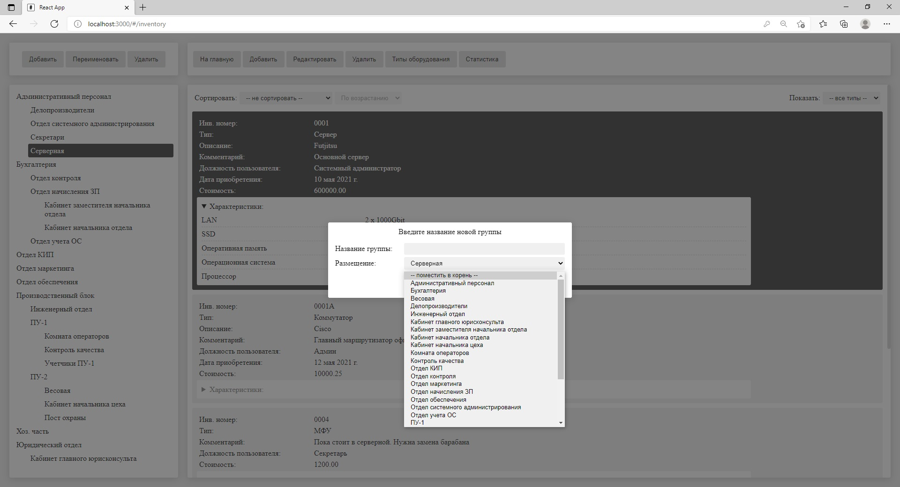

# lite_inventory_react

Этот проект - отдельный фронтенд на React для сервиса [LiteInventory](https://github.com/SergeyLebidko/LiteInventory). Целью разработки этого проекта для меня было освоение библиотек redux, react-redux и redux-thunk. В своем прошлом проекте - [сайте hProger](https://hproger.ru/#/) - я уже использовал redux, но на крайне примитивном уровне, лишь для хранения состояния некоторых компонентов между размонтированием и повторным монтированием.

В lite_inventory_react я использую redux в гораздо большем объеме. Это позволило мне сделать код компонентов гораздо чище, освободив его от хранения состояния и прямой передачи его нижележащим компонентам через пропсы или контекст. А применение thunk дало возможность убрать из компонентов еще и код асинхронного взаимодействия с сервером. Но, как я заметил, это добавляет необходимость выполнения дополнительных (и иногда весьма рутиинных) действий по написанию модулей с создателями действий, редукторами, функциями для отображения состояния хранилища на пропсы и т.д. К тому же размер таких модулей быстро растет и если бы проект был побольше, то их непременно стоило бы разделять на отдельные файлы.

Также я окончательно понял, что написание SCSS-стилей для компонетов, когда структура кода в SCSS повторяет структуру html-элементов (их вложенность и взаимное расположение) - никуда не годится! Раньше мне это казалось очень крутой фичей, но сейчас я понял, что это, наоборот, усложняет работу: изменения в html (например, просто перестановка элементов) сразу же требует переработки и файла стилей. А если стили грубоко вложены друг в друга, то это становится не такой уж простой задачей! В будущих своих проектах я хочу отказаться от этого и использовать более продвинутую методологию работы со стилями - например, БЭМ.

Для запуска проекта нужно иметь запущенный на локальной машине сервер lite_inventory (как его запустить описано [на страничке бэкенда](https://github.com/SergeyLebidko/LiteInventory).

Когда сервер запущен надо клонировать этот проект в отдельную папку (```git clone```), перейти в неё, выполнить установку зависимостей (```npm install```), затем запустить работу командой ```npm run start```.

В проекте также есть файл urls.js, в котором надо поправить значение параметра URL_PREFIX (он содержит адрес сервера и по-умолчанию предполагает, что бэкенд запущен на одной машине с фронтендом). Но делать это нужно только в том случае, если бэкенд и фронтенд работают на разных компьютерах. 

В заключение привожу скриншоты запущенного проекта:



